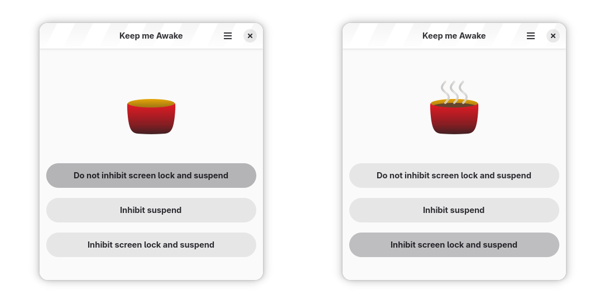

# Keep Me Awake

Inhibit lock screen and suspend.

A small GNOME utility application to inhibit lock screen and suspend.

## Installation

- [Flathub](https://flathub.org/apps/details/de.swsnr.keepmeawake)

## Translations

Please submit translations to <https://translate.codeberg.org/engage/de-swsnr-keepmeawake/>.

## License

Copyright Sebastian Wiesner <sebastian@swsnr.de>

Licensed under the EUPL, see <https://interoperable-europe.ec.europa.eu/collection/eupl/eupl-text-eupl-12>
